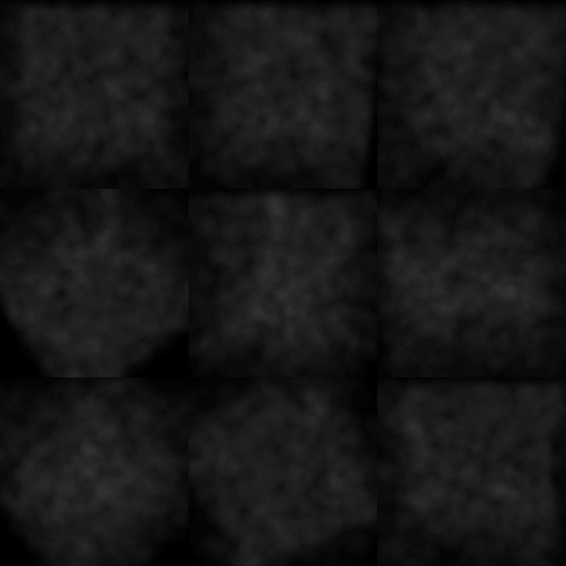

# 3D高斯泼溅的 Warp 实现：并行思维 + 极简代码，没GPU也能跑

## 导语

3D Gaussian Splatting（3DGS）把场景拆成许多"彩色小球"，在屏幕上**同时**叠加成像，效果直观、速度很快。

这份开源实现用 **NVIDIA Warp** 写成：**思路并行、代码极简、结构清爽**。最大的好处是——**没有 GPU 也能先学会**：同一份代码先在 **CPU** 跑通流程，**一行切到 GPU** 再加速。

**上手极快，无需复杂CUDA环境配置**。目标很简单：**好懂、好改、好跑**。



---

## 强调"并行感"，无需 GPU

传统3DGS实现往往让初学者望而却步：要么是复杂的CUDA代码，要么是依赖繁重的框架。这个项目换了个思路。

**1. 好学**：流程清晰，"数据 → 训练 → 渲染 → 可视化"，读完就能跑。代码结构简洁，核心算法集中在几个文件里，没有层层嵌套的抽象。

**2. 并行直觉**：写法像"大家同时做事"，更贴合 CUDA 的思考方式。每个高斯团的投影、颜色计算都是独立的，代码结构直接反映这种并行性。

**3. 跨设备无负担**：同一份代码跑 CPU/GPU，一行切换，不被环境劝退。这对教学和原型验证特别友好——没有高端GPU的开发者也能先理解算法、验证想法。

---

## 它能做什么？

3DGS不仅仅是个渲染技术，在实际应用中有广泛价值：

**数据生成（视觉/机器人）**：更快得到多视角样本，用于检测、位姿估计、抓取等任务。相比传统NeRF方法，3DGS的实时渲染能力让数据生成效率大幅提升。

**仿真与数字孪生**：把真实空间"搬进"仿真环境，先在虚拟世界验证策略。工业场景中，可以快速重建生产线、仓库等环境，用于路径规划和碰撞检测。

**AR/VR 与三维地图**：漫游、预览、轻量重光照与交互原型。3DGS的显式表示让场景编辑变得更直观——你可以直接操作那些"小团"。

---

## 3DGS算法

3D Gaussian Splatting的核心创新在于巧妙地平衡了离散和连续表示。每个场景由大量三维高斯分布组成，每个高斯用以下参数描述：

- **位置 $\mu$**：三维空间中的中心点坐标
- **协方差矩阵 $\Sigma$**：由缩放矩阵$S$和旋转矩阵$R$组成（$\Sigma = RSS^TR^T$），决定椭球的形状和朝向
- **不透明度 $\alpha$**：控制高斯的透明度
- **球谐系数 $c$**：使用球谐函数（Spherical Harmonics）编码视角相关的颜色信息

渲染管线的关键步骤：

**1. 投影变换**：将3D高斯投影到2D图像平面。使用雅可比矩阵$J$进行仿射近似：

$$\Sigma' = JW\Sigma W^T J^T$$

其中$W$是视图变换矩阵，$\Sigma'$是投影后的2D协方差矩阵。这种基于光栅化（rasterization）的方法相比NeRF的光线追踪（ray marching）有着本质优势：避免了沿光线的密集采样，直接将3D高斯投影并光栅化到屏幕，显著提升渲染速度。

**2. 深度排序与Alpha混合**：按深度对高斯排序，使用可微分的Alpha混合计算最终颜色：

$$C = \sum_{i \in N} c_i \alpha_i' \prod_{j=1}^{i-1} (1 - \alpha_j')$$

**3. 自适应密度控制**：通过梯度阈值动态调整高斯密度：
- **克隆（Clone）**：在欠重建区域复制小高斯
- **分裂（Split）**：将过大的高斯分解为更小的高斯
- **剪枝（Prune）**：移除透明度过低（$\alpha < $ 阈值）或过大的高斯

---

## 实现技术亮点：Warp带来的并行编程新体验

NVIDIA Warp是个有趣的框架——它让你用Python语法写并行代码，但实际运行时会编译成高效的机器码。

在这个3DGS实现中，核心渲染循环大概是这样的风格：

```python
@wp.kernel
def render_gaussians(gaussians: wp.array, pixels: wp.array):
    # 每个线程处理一个像素
    pixel_id = wp.tid()
    color = wp.vec3(0.0, 0.0, 0.0)
    
    # 累加所有高斯团的贡献
    for g in gaussians:
        contribution = compute_gaussian_contribution(g, pixel_id)
        color += contribution
    
    pixels[pixel_id] = color
```

看起来就像普通Python，但能在GPU上并行执行数万个像素的计算。

---

## 开源详情

这个项目完全开源，代码结构清晰，适合学习和二次开发。

**项目主页**：https://github.com/guoriyue/3dgs-warp-scratch

作者还有个相关项目，用 Warp 实现模型推理：

**延伸项目**：warp-llama3-scratch —— 用 Warp 写LLM推理，并行写法同样好懂。
https://github.com/guoriyue/warp-llama3-scratch

---