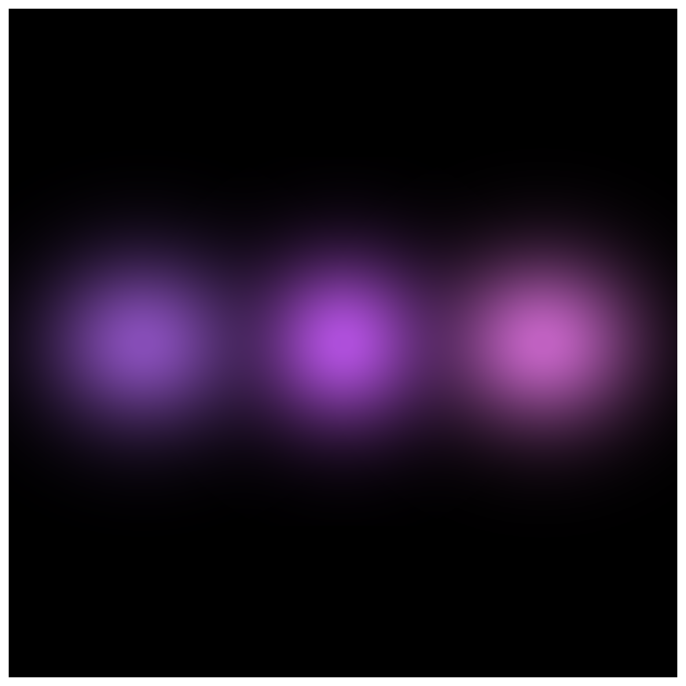

# 3D Gaussian Splatting with Nvidia Warp

3DGS implementation in NVIDIA Warp — clean, minimal, and runs on CPU or GPU.


## Why This Implementation?

### ✅ CPU & GPU with Zero Hassle

Built with NVIDIA Warp, the same code runs seamlessly on both CPU and GPU — no need to deal with CUDA setup, driver issues, or device-specific kernels. Just flip one config line.

### 🧠 Learn Modern Graphics the Easy Way

Explore core concepts in differentiable rendering and parallel graphics programming — no need for expensive GPUs or thousands of lines of boilerplate.

### 📦 Minimalist & Educational

This isn’t another massive codebase. It’s a clean, hackable implementation built for clarity — perfect for study, prototyping, or teaching yourself how Gaussian Splatting works.

## Quick Start

### Installation

```bash
# Clone the repository
git clone https://github.com/guoriyue/3dgs-warp-scratch.git
cd 3dgs-warp-scratch

# Install dependencies
pip install warp-lang==1.7.0 numpy==1.26.4 matplotlib==3.9.2 imageio==2.34.1 tqdm==4.66.5 plyfile torch==2.6.0
```

### Download Example Data

```bash
# Download the Lego dataset
bash download_example_data.sh
```


### Rendering

```bash
# Render 3 Gaussian points – a minimalist example
python render.py
```
You should see 3 Gaussian points like 

### Training

```bash
# Train on Lego dataset (CPU by default)
# For GPU training, change DEVICE in config.py to "cuda"
python train.py
```


## Project Structure

```

├── train.py                  # Main training loop
├── render.py                 # Rendering script to validate outputs; confirms forward pass correctness

├── config.py                 # Configuration and training parameters

├── forward.py                # 3DGS: Forward pass (reimplementation of graphdeco-inria/gaussian-splatting)
├── backward.py               # 3DGS: Backward pass (reimplementation of graphdeco-inria/gaussian-splatting)
├── loss.py                   # Loss functions for training (includes depth loss, though unused in this repo)
├── scheduler.py              # Learning rate scheduler

├── utils/
│   ├── camera_utils.py       # Load camera intrinsics and extrinsics from training data
│   ├── point_cloud_utils.py  # Point cloud I/O utilities (e.g., saving to .ply)
│   ├── math_utils.py         # General math utilities (e.g., transformation matrices)
│   └── wp_utils.py           # Warp utilities for math operations and device transfer

└── data/                     # Contains the NeRF-synthetic 'Lego' dataset

```

`forward.py` and `backward.py` are based on [graphdeco-inria/gaussian-splatting](https://github.com/graphdeco-inria/gaussian-splatting). The original pure CUDA version is now reimplemented in Nvidia Warp, easy to understand, set up, and run.

Densification and pruning logic is based on [yzslab/gaussian-splatting-lightning](https://github.com/yzslab/gaussian-splatting-lightning), but restructured here with minimal data preparation and simplified training logic.

## TODO

- Improve performance: This implementation focuses on correctness and clarity over speed; there's room for Warp kernel optimization.
- Filter inactive points — The saved .ply files include many points that do not contribute to rendering. A better pruning strategy or visibility check is needed.